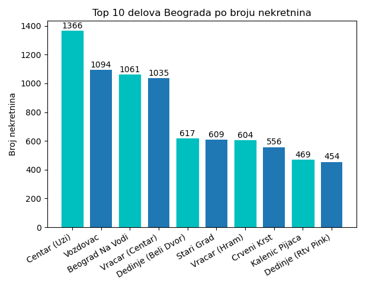

# Machine learning application in predicting prices of real estate

## Summary
&nbsp;&nbsp;&nbsp;&nbsp;The goal of this project is to predict prices of real estates for sale in Belgrade, Serbia. Learning process was done by linear regression and kNN algorithms.
  * First, it was necessary to create web crawler which will scrape real estates from various websites. 
  * Secondly, we needed to write a Python scripts to preprocess data. 
  * Thirdly, we used MySQL and Python scripts to generate queries and plots. 
  * Finally, we used Python to create linear regression and kNN and generate prediction.

## Web crawler & scraper
&nbsp;&nbsp;&nbsp;&nbsp;The data was scrapped from two websites (4zida.rs and nekretnine.rs) using Scrapy framework written in Python. Data, which was scrapped, has a total of over 100,000 different real estates over whole country. For each real eastate following features were scraped: price, type, city, address, square footage, year built, land area (for houses), floor, registration, heating type, number of rooms, number of bathrooms, parking, elevator, terrace. Since each real estate ad is manually added by user, many features were often missing. Output for each website was json file where each element had one real estate and its features.

## Preprocessing data
&nbsp;&nbsp;&nbsp;&nbsp;First step in preprocessing data was merging all data we got from different website into single json file. After that it was necessary to convert all characters and strings to integers or floats. Some ads were written in cyrillic and they had to be converted to latin. There were 5 special cases where user wrongly inserted information that was hard coded. Numerous real estates were deleted because of feature value error (very low/high price, very high number of rooms etc.).
Goal of this project is to predict prices of flats for sale in Belgrade, therefore separate json was created with real estates belonging to that category.

---
Address was separately converted to number because of its complexity. Because location is often key factor in predicting price of real estate, Google Maps API was used to convert addresses to coordinates. After that Geopy library was used to calculate distance between center of Belgrade and given coordinate.

## Visualization
&nbsp;&nbsp;&nbsp;&nbsp;To get more general sense of real estates, six graphs were created.
- Top 10 most popular districts in Belgrade by number of avaliable real estates

- [Flats by number of square footage](visualisation/b/stanovi_po_kvadraturi.png)
- [Real estates by year of construction](visualisation/c/izgradjene_nekretnine.png)
- [For sale/rent by city](visualisation/d/prodaja_iznajmljivanje.png)
- [Price of real estates divided in six groups](visualisation/e/cene_po_opsegu.png)
- [Real estate with/without parking in Belgrade](visualisation/f/izgradjene_nekretnine.png)

## Linear regression
&nbsp;&nbsp;&nbsp;&nbsp; Since not every real estate has every feature, we had to remove some features that had very high amount of real estates ad with empty field. Remaining features which were chosen for linear regression features were address, square footage, floor, number of rooms, parking, elevator and terrace. Before learning data had to be normalized and shuffled. Learning was done by nested 10-fold cross validation with train and dev set so we can find best hyperparameters. There are two hyperparameters: learning rate and mini-batch size.

---

After finding best hyperparameters, 10-fold cross validation was done on test and train (now train set is equal to train and dev set from previous step) set. This was first time evaluation is done on test set. Performanse was calculated with average root mean squared error and average mean absolute error. Next step was training linear regression on whole data using chosen hyperparameters to get best parameters which were exported to [JSON file](\linear_regression\model_parameters.json) for future use.

## kNN
&nbsp;&nbsp;&nbsp;&nbsp;Since kNN is lazy learner, it does not have learning part but there was normalization as hyperparameter to find out does normalization helps in this case or not. K can be manually imputed or automatically calculated as square root of number of real estates. Distance from imputed real estate was calculated with two different methods. First was Euclidean distance, where distance between two points is calculated using the Pythagorean theorem. Second method was Manhatten distance where distance between two points is the sum of the absolute differences of their Cartesian coordinates. kNN does not have any parameters but for algorithm to predicts it needs to run throughout every real estate in data each time.

## Results
&nbsp;&nbsp;&nbsp;&nbsp; Output of each algorithm should be number from range from 0 to 4, where 0 represents price of real estate is under 50,000e, 1 is price between 50 and 100,000e and 4 is over 200,000e. At the evaluation linear regression sees test data for the first time and evaluates its parameters on that data. kNN on other hand just compares each real estate with rest of the data.

- Linear regression achieved ~67% accuracy
- kNN achieved 64% without normalization and 60% with normalization

## Future improvements
&nbsp;&nbsp;&nbsp;&nbsp;Both linear regression and kNN proved not so efficient against complex problem, which means we should use algorithms that are more suited for solving very complex problems like polynomial regression, SVM, neural networks or deep neural networks.
